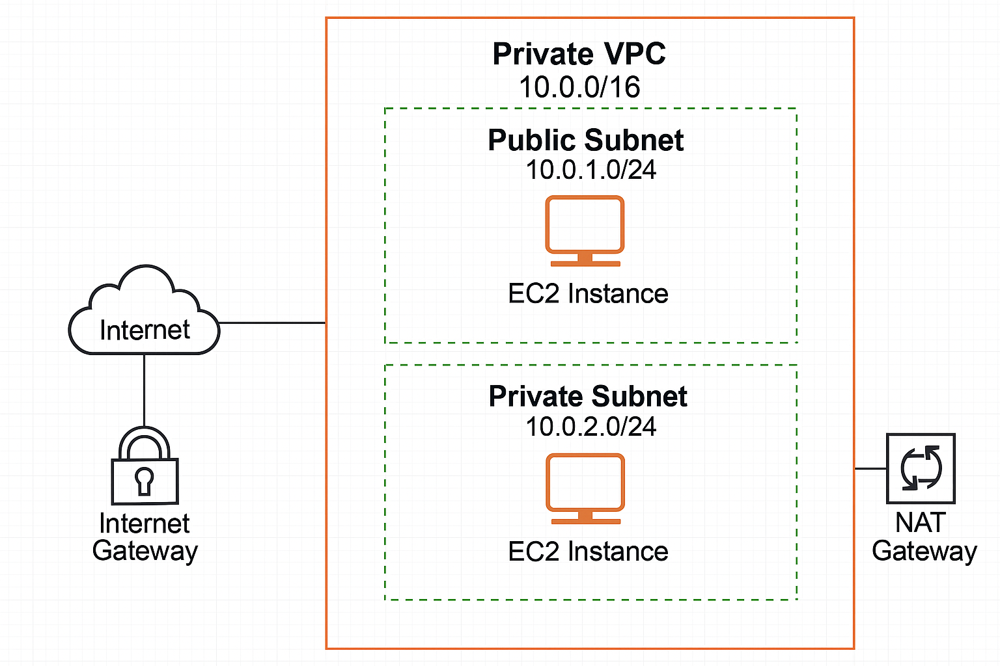
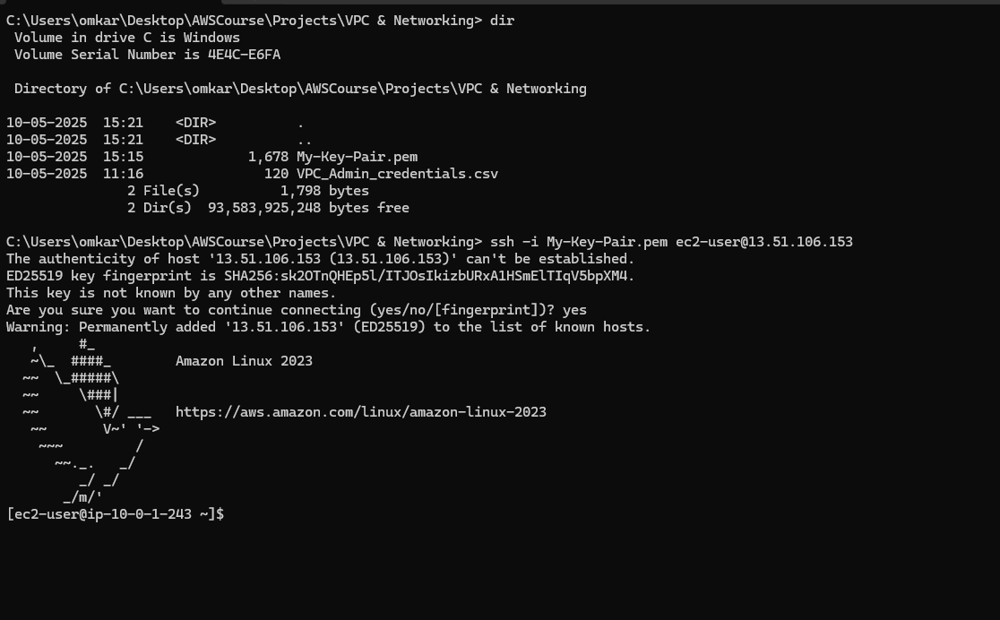

# 🛠️ AWS VPC Hands-On Lab

This project demonstrates how to set up a custom **Virtual Private Cloud (VPC)** from scratch on AWS, including **networking components, subnets, EC2 instances, and secure internet access** using Internet and NAT Gateways.

---

## 01. Project Objective

Build a custom VPC with:
-  1 Public Subnet (for public-facing EC2 instances)
-  1 Private Subnet (for backend/internal EC2 instances)
-  Internet Gateway (for outbound access from the public subnet)
-  NAT Gateway (for secure outbound access from the private subnet)
-  EC2 Instances in each subnet to test connectivity

---

## 02. Network Architecture

---

## 03. VPC Configuration

| Resource           | Configuration                |
|--------------------|------------------------------|
| VPC CIDR           | `10.0.0.0/16`                |
| Public Subnet      | `10.0.1.0/24`                |
| Private Subnet     | `10.0.2.0/24`                |
| Internet Gateway   | Attached to VPC              |
| NAT Gateway        | In public subnet             |
| Public Instance    | Amazon Linux 2, public IP    |
| Private Instance   | Amazon Linux 2, private only |

---

## 04 Step-by-Step Setup

### 1. **Create VPC**
- CIDR: `10.0.0.0/16`

### 2. **Create Subnets**
- Public: `10.0.1.0/24` (Enable auto-assign public IP)
- Private: `10.0.2.0/24`

### 3. **Create & Attach Internet Gateway**

### 4. **Create Route Tables**
- Public Route Table → associate with public subnet, add route to IGW
- Private Route Table → associate with private subnet, add route to NAT

### 5. **Launch EC2 Instances**
- Public Instance: Accessible via SSH
- Private Instance: Connect via Bastion or NAT

### 6. **Create NAT Gateway**
- Allocate Elastic IP
- Deploy NAT in Public Subnet
- Route 0.0.0.0/0 from Private Route Table to NAT

---

## 05 Technologies Used

- Amazon VPC
- EC2 Instances
- Subnets & Route Tables
- Internet Gateway & NAT Gateway
- AWS Console

---

## 06 Output

---

## 07 Folder Structure

aws-vpc-hands-on-lab/
│
├── Architecture/
│ └── aws-vpc-network-diagram.png
├── Images/
│ └── ElasticIPaddresses.png
│ └── Internetgateways.png
│ └── NATgateways.png
│ └── Private&PublicSubnet.png
│ └── Public&PrivateInstances.png
│ └── VPCs.png
└── README.md

---
